# Results Fixed Point
All designs uses the summation tree implementation.
Fixed point target types: 

## Non optimized design.
LoopM iterations: 16
LoopP iterations: 4
LoopN iterations: 16

Array optimizations:
- Nothing...

Loop optimizations:
- Function base: PIPELINE OFF
- LoopM: PIPELINE OFF
- LoopP: PIPELINE OFF
- LoopN: PIPELINE OFF

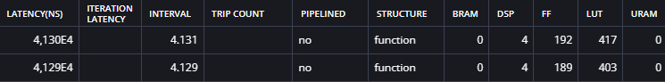

## Optimized design
LoopM iterations: 16
LoopP iterations: 4
LoopN iterations: 16

Array optimizations:
Required for effective UNROLLING of LoopN (use complete because of complete unroll)
- ARRAY_PARTITION variable=A dim=2 type=complete
- ARRAY_PARTITION variable=B dim=1 type=complete 
- ARRAY_PARTITION variable=mulValue dim=1 type=complete

Loop optimizations:
- Function base: PIPELINE OFF
- LoopM: PIPELINE OFF
- LoopP: PIPELINE OFF
- LoopN: UNROLL & PIPELINE
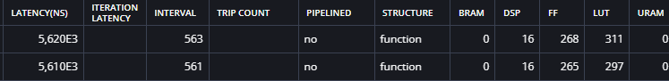

## Optimized design
LoopM iterations: 16
LoopP iterations: 4
LoopN iterations: 16

Array optimizations:
Required for effective UNROLLING of LoopN (use complete because of complete unroll)
- ARRAY_PARTITION variable=A dim=2 type=complete
- ARRAY_PARTITION variable=B dim=1 type=complete 
- ARRAY_PARTITION variable=mulValue dim=1 type=complete

Loop optimizations:
- Function base: PIPELINE OFF
- LoopM: PIPELINE OFF
- LoopP: PIPELINE
- LoopN: UNROLL & PIPELINE
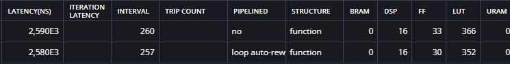

## Optimized design
LoopM iterations: 16
LoopP iterations: 4
LoopN iterations: 16

Array optimizations:
Required for effective UNROLLING of LoopN (use complete because of complete unroll)
- ARRAY_PARTITION variable=A dim=2 type=complete
- ARRAY_PARTITION variable=B dim=1 type=complete 
- ARRAY_PARTITION variable=mulValue dim=1 type=complete

Loop optimizations:
- Function base: PIPELINE OFF
- LoopM: PIPELINE
- LoopP: PIPELINE
- LoopN: UNROLL & PIPELINE
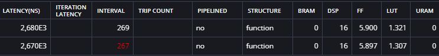

## Optimized design
LoopM iterations: 16
LoopP iterations: 4
LoopN iterations: 16

Array optimizations:
Required for effective UNROLLING of LoopN (use complete because of complete unroll)
- ARRAY_PARTITION variable=A dim=2 type=complete
- ARRAY_PARTITION variable=B dim=1 type=complete 

Required for effective UNROLLING of LoopP (cyclic because of partial unrolling)
- ARRAY_PARTITION variable=C dim=2 type=cyclic factor=2
- ARRAY_PARTITION variable=B dim=2 type=cyclic factor=2

- ARRAY_PARTITION variable=mulValue dim=1 type=complete

Loop optimizations:
- Function base: PIPELINE OFF
- LoopM: PIPELINE
- LoopP: UNROLL factor=2 & PIPELINE
- LoopN: UNROLL & PIPELINE
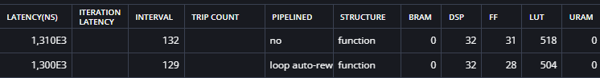

## Optimized design
LoopM iterations: 16
LoopP iterations: 4
LoopN iterations: 16

Array optimizations:
Required for effective UNROLLING of LoopN (use complete because of complete unroll)
- ARRAY_PARTITION variable=A dim=2 type=complete
- ARRAY_PARTITION variable=B dim=1 type=complete 

Required for effective UNROLLING of LoopP (cyclic because of partial unrolling)
- ARRAY_PARTITION variable=C dim=2 type=cyclic factor=4
- ARRAY_PARTITION variable=B dim=2 type=cyclic factor=4

- ARRAY_PARTITION variable=mulValue dim=1 type=complete

Loop optimizations:
- Function base: PIPELINE OFF
- LoopM: PIPELINE
- LoopP: UNROLL factor=4 & PIPELINE
- LoopN: UNROLL & PIPELINE
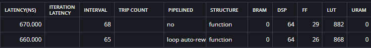

## Optimized design
LoopM iterations: 16
LoopP iterations: 4
LoopN iterations: 16

Array optimizations:
Required for effective UNROLLING of LoopN (use complete because of complete unroll)
- ARRAY_PARTITION variable=A dim=2 type=complete
- ARRAY_PARTITION variable=B dim=1 type=complete 

Required for effective UNROLLING of LoopP (cyclic because of partial unrolling)
- ARRAY_PARTITION variable=C dim=2 type=cyclic factor=8
- ARRAY_PARTITION variable=B dim=2 type=cyclic factor=8

- ARRAY_PARTITION variable=mulValue dim=1 type=complete

Loop optimizations:
- Function base: PIPELINE OFF
- LoopM: PIPELINE
- LoopP: UNROLL factor=8 & PIPELINE
- LoopN: UNROLL & PIPELINE
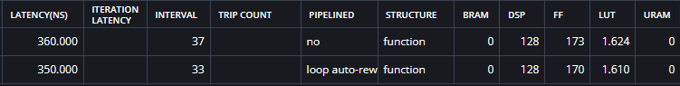

## Optimized design
LoopM iterations: 16
LoopP iterations: 4
LoopN iterations: 16

Array optimizations:
Required for effective UNROLLING of LoopN (use complete because of complete unroll)
- ARRAY_PARTITION variable=A dim=2 type=complete
- ARRAY_PARTITION variable=B dim=1 type=complete 

Required for effective UNROLLING of LoopP (cyclic because of partial unrolling)
- ARRAY_PARTITION variable=C dim=2 type=complete
- ARRAY_PARTITION variable=B dim=2 type=complete

- ARRAY_PARTITION variable=mulValue dim=1 type=complete

Loop optimizations:
- Function base: PIPELINE OFF
- LoopM: PIPELINE
- LoopP: UNROLL
- LoopN: UNROLL & PIPELINE

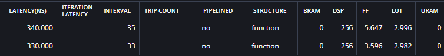

## Optimized design
LoopM iterations: 16
LoopP iterations: 4
LoopN iterations: 16

Array optimizations:
Required for effective UNROLLING of LoopN (use complete because of complete unroll)
- ARRAY_PARTITION variable=A dim=2 type=complete
- ARRAY_PARTITION variable=B dim=1 type=complete 

Required for effective UNROLLING of LoopP (cyclic because of partial unrolling)
- ARRAY_PARTITION variable=C dim=2 type=complete
- ARRAY_PARTITION variable=B dim=2 type=complete

Required for effective UNROLLING of LoopM
- ARRAY_PARTITION variable=A dim=1 type=cyclic factor=2
- ARRAY_PARTITION variable=C dim=1 type=cyclic factor=2

- ARRAY_PARTITION variable=mulValue dim=1 type=complete

Loop optimizations:
- Function base: PIPELINE OFF
- LoopM: UNROLL factor=2 & PIPELINE OFF
- LoopP: UNROLL & PIPELINE OFF
- LoopN: UNROLL & PIPELINE

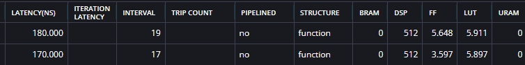

## Optimized design
LoopM iterations: 16
LoopP iterations: 4
LoopN iterations: 16

Array optimizations:
Required for effective UNROLLING of LoopN (use complete because of complete unroll)
- ARRAY_PARTITION variable=A dim=2 type=complete
- ARRAY_PARTITION variable=B dim=1 type=complete 

Required for effective UNROLLING of LoopP (cyclic because of partial unrolling)
- ARRAY_PARTITION variable=C dim=2 type=complete
- ARRAY_PARTITION variable=B dim=2 type=complete

Required for effective UNROLLING of LoopM
- ARRAY_PARTITION variable=A dim=1 type=cyclic factor=4
- ARRAY_PARTITION variable=C dim=1 type=cyclic factor=4

- ARRAY_PARTITION variable=mulValue dim=1 type=complete

Loop optimizations:
- Function base: PIPELINE OFF
- LoopM: UNROLL factor=4 & PIPELINE OFF
- LoopP: UNROLL & PIPELINE OFF
- LoopN: UNROLL & PIPELINE

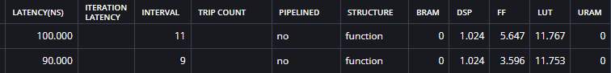

## Optimized design
LoopM iterations: 16
LoopP iterations: 4
LoopN iterations: 16

Array optimizations:
Required for effective UNROLLING of LoopN (use complete because of complete unroll)
- ARRAY_PARTITION variable=A dim=2 type=complete
- ARRAY_PARTITION variable=B dim=1 type=complete 

Required for effective UNROLLING of LoopP (cyclic because of partial unrolling)
- ARRAY_PARTITION variable=C dim=2 type=complete
- ARRAY_PARTITION variable=B dim=2 type=complete

Required for effective UNROLLING of LoopM
- ARRAY_PARTITION variable=A dim=1 type=cyclic factor=8
- ARRAY_PARTITION variable=C dim=1 type=cyclic factor=8

- ARRAY_PARTITION variable=mulValue dim=1 type=complete

Loop optimizations:
- Function base: PIPELINE OFF
- LoopM: UNROLL factor=8 & PIPELINE OFF
- LoopP: UNROLL & PIPELINE OFF
- LoopN: UNROLL & PIPELINE

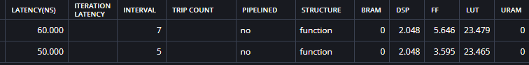