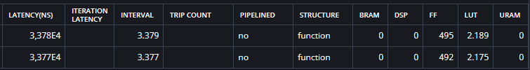
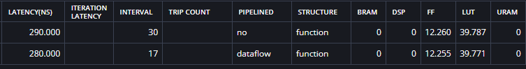
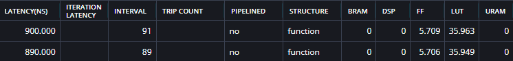
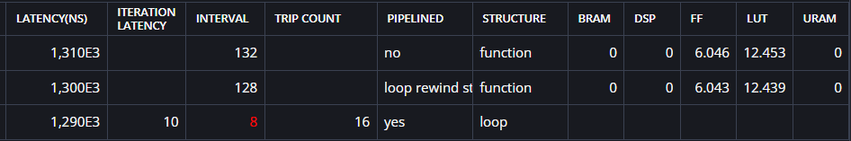
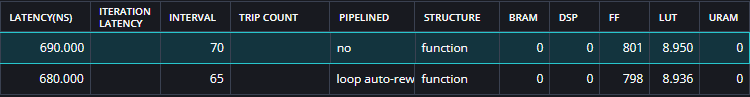
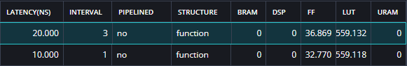
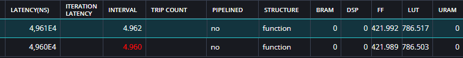

# Results

## Baseline - Summation tree based
LoopM iterations: 16
LoopP iterations: 4
LoopN iterations: 16

Array optimizations:
- A: ARRAY_PARTITION variable=A dim=2 type=complete
- B: ARRAY_PARTITION variable=B dim=1 type=complete
- C: ARRAY_PARTITION variable=C dim=2 type=complete

Loop optimizations:
- Function base: PIPELINE OFF
- LoopM: PIPELINE OFF
- LoopP: PIPELINE OFF
- LoopN: PIPELINE OFF

## Optimization try 1 - Summation tree based
LoopM iterations: 16
LoopP iterations: 4
LoopN iterations: 16

Array optimizations:
- A: ARRAY_PARTITION variable=A dim=2 type=complete
- B: ARRAY_PARTITION variable=B dim=1 type=complete
- C: ARRAY_PARTITION variable=C dim=2 type=complete

Loop optimizations:
- Function base: PIPELINE OFF
- LoopM: PIPELINE OFF
- LoopP: PIPELINE OFF
- LoopN: UNROLL

## Optimization try 2 - Summation tree based
LoopM iterations: 16
LoopP iterations: 4
LoopN iterations: 16

Array optimizations:
- A: ARRAY_PARTITION variable=A dim=2 type=complete
- B: ARRAY_PARTITION variable=B dim=1 type=complete
- C: ARRAY_PARTITION variable=C dim=2 type=complete

Loop optimizations:
- Function base: PIPELINE OFF
- LoopM: PIPELINE OFF
- LoopP: PIPELINE ON
- LoopN: UNROLL

## Optimization try 3 - Summation tree based
LoopM iterations: 16
LoopP iterations: 4
LoopN iterations: 16

Array optimizations:
- A: ARRAY_PARTITION variable=A dim=2 type=complete
- B: ARRAY_PARTITION variable=B dim=1 type=complete
- C: ARRAY_PARTITION variable=C dim=2 type=complete

Loop optimizations:
- Function base: PIPELINE OFF
- LoopM: PIPELINE ON
- LoopP: PIPELINE ON
- LoopN: UNROLL

## Optimization try 4 - Summation tree based
LoopM iterations: 16
LoopP iterations: 4
LoopN iterations: 16

Array optimizations:
- A: ARRAY_PARTITION variable=A dim=2 type=complete
- B: ARRAY_PARTITION variable=B dim=1 type=complete
- C: ARRAY_PARTITION variable=C dim=2 type=complete

Loop optimizations:
- Function base: DATAFLOW
- LoopM: PIPELINE ON
- LoopP: PIPELINE ON
- LoopN: UNROLL

## Optimization try 5 - Summation tree based
LoopM iterations: 16
LoopP iterations: 4
LoopN iterations: 16

Array optimizations:
- A: ARRAY_PARTITION variable=A dim=2 type=complete
- B: ARRAY_PARTITION variable=B dim=1 type=complete
- C: ARRAY_PARTITION variable=C dim=2 type=complete

Loop optimizations:
- Function base: PIPELINE OFF
- LoopM: PIPELINE OFF
- LoopP: UNROLL
- LoopN: UNROLL

## Optimization try 6 - Summation tree based
LoopM iterations: 16
LoopP iterations: 4
LoopN iterations: 16

Array optimizations:
- A: ARRAY_PARTITION variable=A dim=2 type=complete
- B: ARRAY_PARTITION variable=B dim=1 type=complete
- C: ARRAY_PARTITION variable=C dim=2 type=complete

Loop optimizations:
- Function base: PIPELINE OFF
- LoopM: PIPELINE STYLE=STP REWIND=TRUE
- LoopP: UNROLL
- LoopN: UNROLL

## Optimization try 7 - Summation tree based
LoopM iterations: 16
LoopP iterations: 4
LoopN iterations: 16

Array optimizations:
- A: ARRAY_PARTITION variable=A dim=2 type=complete
- B: ARRAY_PARTITION variable=B dim=1 type=complete
- C: ARRAY_PARTITION variable=C dim=2 type=complete

Loop optimizations:
- Function base: PIPELINE OFF
- LoopM: PIPELINE STYLE=STP REWIND=TRUE
- LoopP: PIPELINE STYLE=STP REWIND=TRUE
- LoopN: UNROLL

## Optimization optimal design 0 - Summation tree based
LoopM iterations: 16
LoopP iterations: 4
LoopN iterations: 16

Array optimizations:
Required for effective UNROLLING of LoopN (use complete because of complete unroll)
- ARRAY_PARTITION variable=A dim=2 type=complete
- ARRAY_PARTITION variable=B dim=1 type=complete 

Required for effective UNROLLING of LoopP (cyclic because of partial unrolling)
- ARRAY_PARTITION variable=C dim=2 type=cyclic factor=1
- ARRAY_PARTITION variable=B dim=2 type=cyclic factor=1

Loop optimizations:
- Function base: PIPELINE OFF
- LoopM: PIPELINE OFF
- LoopP: PIPELINE OFF
- LoopN: UNROLL

## Optimization optimal design 1 - Summation tree based
LoopM iterations: 16
LoopP iterations: 4
LoopN iterations: 16

Array optimizations:
Required for effective UNROLLING of LoopN (use complete because of complete unroll)
- ARRAY_PARTITION variable=A dim=2 type=complete
- ARRAY_PARTITION variable=B dim=1 type=complete 

Required for effective UNROLLING of LoopP (cyclic because of partial unrolling)
- ARRAY_PARTITION variable=C dim=2 type=cyclic factor=2
- ARRAY_PARTITION variable=B dim=2 type=cyclic factor=2

Loop optimizations:
- Function base: PIPELINE OFF
- LoopM: PIPELINE OFF
- LoopP: UNROLL factor=2 & PIPELINE
- LoopN: UNROLL

## Optimization optimal design 2 - Summation tree based
LoopM iterations: 16
LoopP iterations: 4
LoopN iterations: 16

Array optimizations:
Required for effective UNROLLING of LoopN (use complete because of complete unroll)
- ARRAY_PARTITION variable=A dim=2 type=complete
- ARRAY_PARTITION variable=B dim=1 type=complete 

Required for effective UNROLLING of LoopP (cyclic because of partial unrolling)
- ARRAY_PARTITION variable=C dim=2 type=cyclic factor=4
- ARRAY_PARTITION variable=B dim=2 type=cyclic factor=4

Loop optimizations:
- Function base: PIPELINE OFF
- LoopM: PIPELINE OFF
- LoopP: UNROLL factor=4 & PIPELINE
- LoopN: UNROLL

## Optimization optimal design 3 - Summation tree based
LoopM iterations: 16
LoopP iterations: 4
LoopN iterations: 16

Array optimizations:
Required for effective UNROLLING of LoopN (use complete because of complete unroll)
- ARRAY_PARTITION variable=A dim=2 type=complete
- ARRAY_PARTITION variable=B dim=1 type=complete 

Required for effective UNROLLING of LoopP (cyclic because of partial unrolling)
- ARRAY_PARTITION variable=C dim=2 type=cyclic factor=8
- ARRAY_PARTITION variable=B dim=2 type=cyclic factor=8

Loop optimizations:
- Function base: PIPELINE OFF
- LoopM: PIPELINE OFF
- LoopP: UNROLL factor=8 & PIPELINE
- LoopN: UNROLL

## Optimization optimal design 4 - Summation tree based
LoopM iterations: 16
LoopP iterations: 4
LoopN iterations: 16

Array optimizations:
Required for effective UNROLLING of LoopN (use complete because of complete unroll)
- ARRAY_PARTITION variable=A dim=2 type=complete
- ARRAY_PARTITION variable=B dim=1 type=complete 

Required for effective UNROLLING of LoopP (cyclic because of partial unrolling)
- ARRAY_PARTITION variable=C dim=2 type=complete
- ARRAY_PARTITION variable=B dim=2 type=complete

Loop optimizations:
- Function base: PIPELINE OFF
- LoopM: PIPELINE OFF
- LoopP: UNROLL & PIPELINE
- LoopN: UNROLL

## Optimization optimal design 5 - Summation tree based
LoopM iterations: 16
LoopP iterations: 4
LoopN iterations: 16

Array optimizations:
Required for effective UNROLLING of LoopN (use complete because of complete unroll)
- ARRAY_PARTITION variable=A dim=2 type=complete
- ARRAY_PARTITION variable=B dim=1 type=complete 

Required for effective UNROLLING of LoopP (cyclic because of partial unrolling)
- ARRAY_PARTITION variable=C dim=2 type=cyclic factor=8
- ARRAY_PARTITION variable=B dim=2 type=cyclic factor=8

Required for effective UNROLLING of LoopM
- ARRAY_PARTITION variable=A dim=1 type=cyclic factor=2
- ARRAY_PARTITION variable=C dim=1 type=cyclic factor=2

Loop optimizations:
- Function base: PIPELINE OFF
- LoopM: PIPELINE OFF
- LoopP: UNROLL factor=8 & PIPELINE
- LoopN: UNROLL

## Optimization optimal design 6 - Summation tree based 
NOTE Compilation time was 6 minutes!

LoopM iterations: 16
LoopP iterations: 4
LoopN iterations: 16

Array optimizations:
Required for effective UNROLLING of LoopN (use complete because of complete unroll)
- ARRAY_PARTITION variable=A dim=2 type=complete
- ARRAY_PARTITION variable=B dim=1 type=complete 

Required for effective UNROLLING of LoopP (cyclic because of partial unrolling)
- ARRAY_PARTITION variable=C dim=2 type=complete
- ARRAY_PARTITION variable=B dim=2 type=complete

Required for effective UNROLLING of LoopM
- ARRAY_PARTITION variable=A dim=1 type=complete
- ARRAY_PARTITION variable=C dim=1 type=complete

Loop optimizations:
- Function base: PIPELINE OFF
- LoopM: UNROLL FACTOR=4 & PIPELINE
- LoopP: UNROLL
- LoopN: UNROLL

## Optimization optimal design COMPLETE UNROLL - Summation tree based 
NOTE Compilation time was 35 minutes!

LoopM iterations: 16
LoopP iterations: 4
LoopN iterations: 16

Array optimizations:
Required for effective UNROLLING of LoopN (use complete because of complete unroll)
- ARRAY_PARTITION variable=A dim=2 type=complete
- ARRAY_PARTITION variable=B dim=1 type=complete 

Required for effective UNROLLING of LoopP (cyclic because of partial unrolling)
- ARRAY_PARTITION variable=C dim=2 type=complete
- ARRAY_PARTITION variable=B dim=2 type=complete

Required for effective UNROLLING of LoopM
- ARRAY_PARTITION variable=A dim=1 type=complete
- ARRAY_PARTITION variable=C dim=1 type=complete

Loop optimizations:
- Function base: PIPELINE OFF
- LoopM: UNROLL
- LoopP: UNROLL
- LoopN: UNROLL

## Optimization optimal design - Summation tree based 
LoopM iterations: 16
LoopP iterations: 4
LoopN iterations: 16

Array optimizations:
Required for effective UNROLLING of LoopN (use complete because of complete unroll)
- ARRAY_PARTITION variable=A dim=2 type=complete
- ARRAY_PARTITION variable=B dim=1 type=complete 

Required for effective UNROLLING of LoopP (cyclic because of partial unrolling)
- ARRAY_PARTITION variable=C dim=2 type=cyclic factor=8
- ARRAY_PARTITION variable=B dim=2 type=cyclic factor=8

Required for effective UNROLLING of LoopM
- ARRAY_PARTITION variable=A dim=1 type=complete
- ARRAY_PARTITION variable=C dim=1 type=complete

Loop optimizations:
- Function base: PIPELINE OFF
- LoopM: PIPELINE
- LoopP: UNROLL factor=8 & PIPELINE
- LoopN: UNROLL

## Optimization optimal design - Summation tree based 
LoopM iterations: 16
LoopP iterations: 4
LoopN iterations: 16

Array optimizations:
Required for effective UNROLLING of LoopN (use complete because of complete unroll)
- ARRAY_PARTITION variable=A dim=2 type=complete
- ARRAY_PARTITION variable=B dim=1 type=complete 

Required for effective UNROLLING of LoopP (cyclic because of partial unrolling)
- ARRAY_PARTITION variable=C dim=2 type=cyclic factor=8
- ARRAY_PARTITION variable=B dim=2 type=cyclic factor=8

Loop optimizations:
- Function base: PIPELINE OFF
- LoopM: PIPELINE
- LoopP: UNROLL factor=8 & PIPELINE
- LoopN: UNROLL

## BIG DESIGN UNROLL - Summation tree based 
LoopM iterations: 197
LoopP iterations: 32
LoopN iterations: 197

Array optimizations:
Required for effective UNROLLING of LoopN (use complete because of complete unroll)
- ARRAY_PARTITION variable=A dim=2 type=complete
- ARRAY_PARTITION variable=B dim=1 type=complete 

Required for effective UNROLLING of LoopP (cyclic because of partial unrolling)
- ARRAY_PARTITION variable=C dim=2 type=cyclic factor=4
- ARRAY_PARTITION variable=B dim=2 type=cyclic factor=4

Loop optimizations:
- Function base: PIPELINE OFF
- LoopM: PIPELINE
- LoopP: UNROLL factor=4 & PIPELINE
- LoopN: UNROLL

JESUS FUCK
